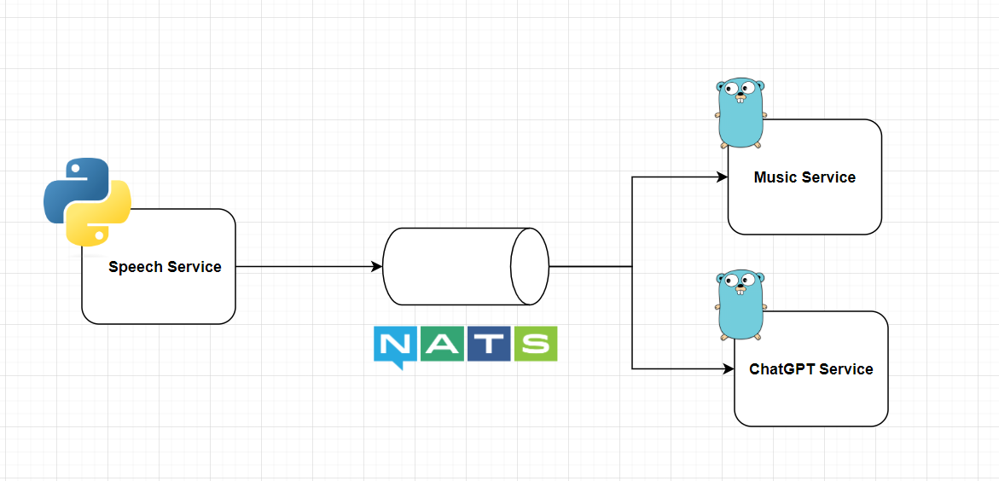

# Chatter

## Overview 

A small and simple microservice application using python speech recognition and nats pub sub
to deliver messages across golang backend services

## Flow

## Todo
 - Dispatch and food ordering API (Grab and Uber)
 - Predictions such as Markets and Weather
 - News web feed
 - IOT (Internet of Things)
 - NoSQL
 - Implement the latest ChatGpt from Open API
 - Text to speech
 - App in Ionic React